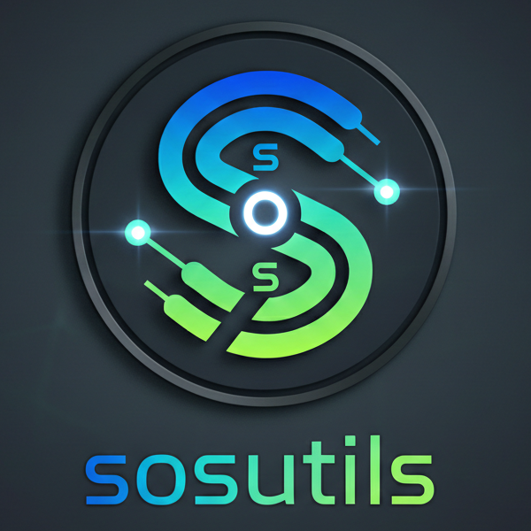

<!--
SPDX-License-Identifier: 0BSD OR Apache-2.0 OR EUPL-1.2 
SPDX-FileCopyrightText: © 2026 Sebastian Ritter
-->
# SOS coreutils

 
Implementations of utils    with  <a href="https://swift.org" target="swift">Swift Programming Language</a>.

## [coreutils](Sources/core/Documentation.docc/SOS.coreutils.md) 
